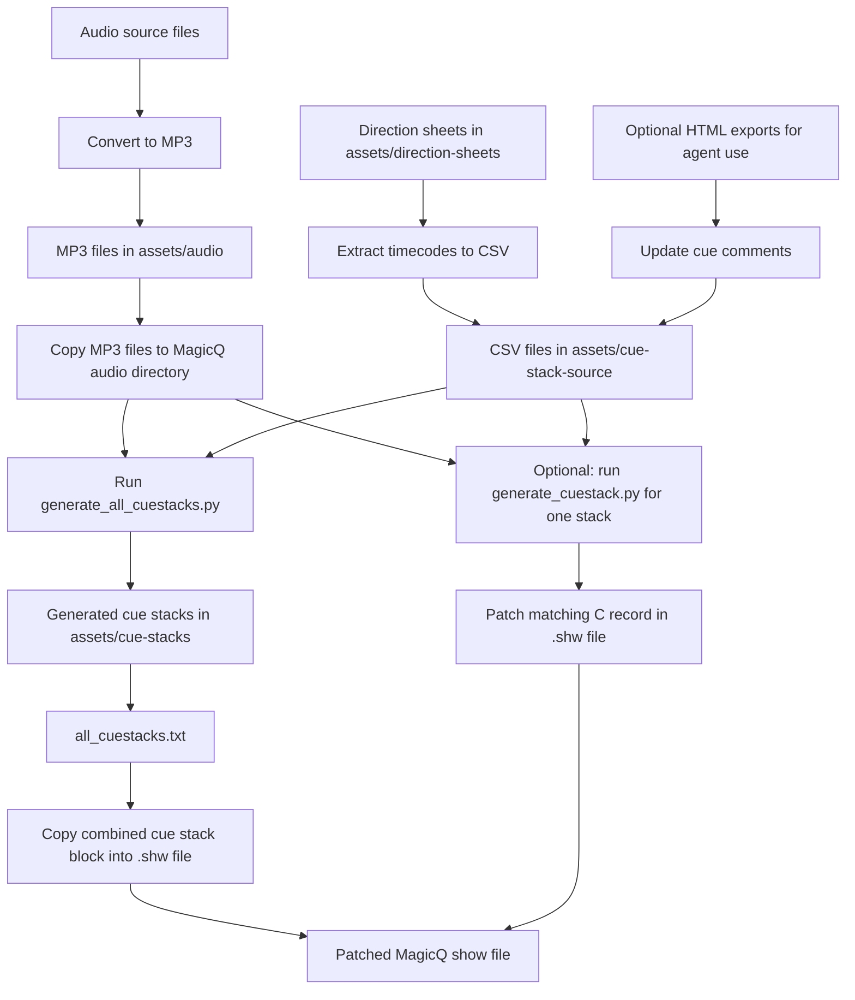

# MagicQ Show Cue Stack Tools

This repository contains a MagicQ show file plus a small Python workflow for generating cue stack `C` records from CSV timing sheets.

The main use case is:

1. Prepare or update cue timings in `assets/cue-stack-source/*.csv`.
2. Optionally derive short cue comments from direction-sheet exports in `assets/direction-sheets/`.
3. Generate MagicQ cue stack blocks into `assets/cue-stacks/`.
4. Optionally patch a generated block back into a `.shw` show file.

## Repository layout

- `generate_cuestack.py`: generate a single MagicQ cue stack block from one CSV, or patch it into a `.shw` file.
- `generate_all_cuestacks.py`: generate cue stack blocks for every CSV in `assets/cue-stack-source/`.
- `assets/cue-stack-source/`: source CSV files, one per block or act.
- `assets/cue-stacks/`: generated cue stack text files, plus `all_cuestacks.txt`.
- `assets/direction-sheets/`: source direction sheets in HTML and XLSX form.
- `assets/audio/`: audio files matched to source CSV filenames.
- `.github/agents/magicq-direction-sheet-csv.agent.md`: custom agent instructions for filling CSV comments from direction sheets.
- `*.shw`, `*.sbk`, `*.xhw`: MagicQ show files and related show data.

## Requirements

- Python 3.10 or newer
- No third-party Python packages are required

## Project setup

Before using the generators, set up the project inside your local MagicQ show environment:

1. Merge this project into your local MagicQ show directory rather than running it from an unrelated folder.
2. Place all direction sheets in `assets/direction-sheets/`.
3. Extract the timing data from those direction sheets into CSV files and store the resulting cue timing files in `assets/cue-stack-source/`.
4. If you want to use the direction-sheet agent, export each relevant `.xlsx` direction sheet to HTML and place those HTML exports alongside the spreadsheets in `assets/direction-sheets/`.
5. If you do not use the agent, set and adapt the cue comments manually in the CSV files in `assets/cue-stack-source/`.
6. Place all audio files in `assets/audio/`.
7. Convert those audio files to MP3 so the audio assets in `assets/audio/` use the expected format for this workflow. See command examples below.
8. Copy the resulting MP3 files from `assets/audio/` into the MagicQ `audio/` directory.

```bash
# Convert to MP3 with ffmpeg
ffmpeg -i input.mpeg -vn -c:a libmp3lame -b:a 320k output.mp3

# Copy MP3 files to MagicQ audio directory
cp assets/audio/*.mp3 audio/
```

In short, `assets/direction-sheets/` is the source area for spreadsheets and optional HTML exports, `assets/cue-stack-source/` contains the extracted cue timing CSVs, and `assets/audio/` contains the MP3 audio files matched against the CSV filenames.

## Workflow diagram



## Source CSV format

Each source file is a CSV with this header:

```csv
time,comment
00:00.0,"volgspot rechts"
00:04.0,"volgspot links"
```

Observed time formats accepted by the generator:

- `M:SS`
- `MM:SS`
- `MM:SS.d`
- `MM:SS.dd`
- `H:MM:SS`

Notes:

- Row order is preserved.
- The `comment` field becomes both the cue label and the cue comment block in the generated MagicQ stack.
- `generate_cuestack.py` alternates cues between scene IDs `0029` and `002a`.

## Filename conventions

Batch generation expects source files in this format:

```text
<number>_<name>.csv
```

Examples:

- `1_blok1.csv`
- `4_blok3-zondag.csv`
- `11_16-en-finale.csv`

The batch script uses:

- the numeric prefix as the source number
- the suffix as the cue stack name
- a relaxed audio match where hyphens and underscores are treated as equivalent

For example, `7_fusion-zondag.csv` can match an audio file named `7_fusion_zondag.mp3`.

One non-obvious detail: `generate_all_cuestacks.py` sets `stack_id = file_number + 1`, so `1_blok1.csv` becomes cue stack `0002`.

## Generate one cue stack

Print a generated stack to stdout:

```bash
python3 generate_cuestack.py assets/cue-stack-source/1_blok1.csv
```

Write it to a file:

```bash
python3 generate_cuestack.py assets/cue-stack-source/1_blok1.csv \
  --output assets/cue-stacks/1_blok1_cuestack.txt
```

Generate with explicit metadata:

```bash
python3 generate_cuestack.py assets/cue-stack-source/1_blok1.csv \
  --stack-id 0002 \
  --stack-name blok1 \
  --audio-file 1_blok1.mpeg
```

Patch the matching `C,<stack_id>` record inside a show file:

```bash
python3 generate_cuestack.py assets/cue-stack-source/1_blok1.csv \
  --stack-id 0002 \
  --stack-name blok1 \
  --audio-file 1_blok1.mpeg \
  --patch "ROM SHOW 2026.shw"
```

The patch step replaces the existing `C,XXXX` record in-place and writes the `.shw` file back using Latin-1 encoding.

## Generate all cue stacks

Generate one output file per source CSV:

```bash
python3 generate_all_cuestacks.py
```

Generate all cue stacks and a combined output file:

```bash
python3 generate_all_cuestacks.py \
  --combined-output assets/cue-stacks/all_cuestacks.txt
```

Use custom directories:

```bash
python3 generate_all_cuestacks.py \
  --csv-dir assets/cue-stack-source \
  --audio-dir assets/audio \
  --output-dir assets/cue-stacks
```

The script will fail fast if:

- a CSV filename does not match `<number>_<name>.csv`
- no matching audio file is found
- multiple audio files match the same CSV
- a CSV contains no cues

## Manual patch into the show file

The first patch step in this project is manual: generate the combined cue stack output, then copy its contents into the target `.shw` file.

Generate the combined output:

```bash
python3 generate_all_cuestacks.py \
  --combined-output assets/cue-stacks/all_cuestacks.txt
```

Then:

1. Open `assets/cue-stacks/all_cuestacks.txt`.
2. Copy the full generated contents.
3. Open the target `.shw` file.
4. Replace the existing cue stack `C` records in the show file with the copied generated block.
5. Save the `.shw` file as a backup-aware manual patch step before any further automated edits.

This is the safest way to refresh all generated cue stacks in one pass when you want full control over what is inserted into the show file.

## Direction-sheet workflow

The repository includes a custom agent definition in `.github/agents/magicq-direction-sheet-csv.agent.md` for adapting CSV comments from direction-sheet HTML files.

That workflow is intended for cases where:

- the CSV already has timecodes
- the direction sheet has richer descriptive text
- the final cue comments must stay short and cue-like

If you opt out of using the agent, you can set and refine the `comment` values manually in the source CSV files instead.

The agent instructions enforce these rules:

- do not change times or row order
- do not exceed 15 characters for comments
- prefer exact timestamp matches from the HTML
- leave unresolved timestamps unchanged

This keeps the source CSVs aligned with the generated MagicQ cue stack labels.

## Output format

The generated files in `assets/cue-stacks/` are MagicQ cue stack `C` records. In practice, the scripts clone the opaque trailing metadata from a known-good stack and only compute the fields that are understood and intentionally controlled:

- stack ID and stack name
- cue count
- cue labels and comments
- per-cue next/previous links
- alternating scene assignment
- cue timecodes in centiseconds
- optional audio filename metadata

## Typical workflow

```bash
# 1. update source timings and comments
# 2. regenerate all cue stacks
python3 generate_all_cuestacks.py --combined-output assets/cue-stacks/all_cuestacks.txt

# 3. copy assets/cue-stacks/all_cuestacks.txt into the .shw file manually

# 4. patch an individual stack back into the show if needed
python3 generate_cuestack.py assets/cue-stack-source/1_blok1.csv \
  --stack-id 0002 \
  --stack-name blok1 \
  --audio-file 1_blok1.mpeg \
  --patch "ROM SHOW 2026.shw"
```

## Safety notes

- Keep backups of `.shw` files before patching.
- Review generated cue stack text before patching live show data.
- The scripts assume the target cue stack already exists in the `.shw` file when using `--patch`.

## TODO
- [ ] Cloning into a non-empty dir is hard, so we should add a script to merge this project into an existing show directory, rather than expecting users to do it manually. Or the project could be structured as a standalone package that can be installed into an existing show directory without needing to merge files at all.
- [ ] Allow cue stack settings to be configured from the command line or a config file, rather than hardcoding them in the script.
- [ ] Add more robust error handling and validation for input CSV files, such as checking for valid time formats and ensuring required fields are present.
- [ ] Implement a dry-run mode that shows a summary of changes without writing output files or patching the show file, to help users verify before making changes.
- [ ] Add logging to track the generation and patching process, including any warnings or errors encountered.
- [ ] Based on config we should be able to set the playback and page for the cue stack, and then also generate the corresponding `P` record for the page if it doesn't exist.
- [ ] Check if it's feasible to generate a full show file from scratch with all cue stacks, rather than patching into an existing file. This would be a bigger change but could simplify the workflow and reduce risks of manual patching.
- [ ] Check if we can create cues from config as well, rather than just generating the cue stack block. This would allow for more complete automation of the show file generation process.
